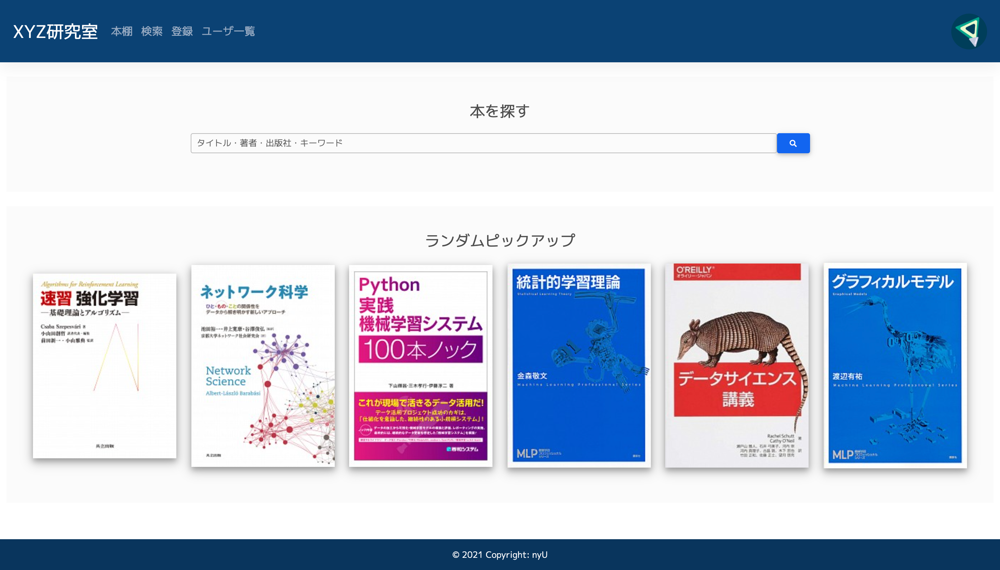

# shisho
2021.08.04 更新


<!-- START doctoc generated TOC please keep comment here to allow auto update -->
<!-- DON'T EDIT THIS SECTION, INSTEAD RE-RUN doctoc TO UPDATE -->

<p align="center">
<a href="#-%E3%83%9D%E3%82%A4%E3%83%B3%E3%83%88">✅ ポイント</a>
<span>|</span>
<a href="#-%E4%BB%8A%E5%BE%8C%E3%81%AE%E4%BA%88%E5%AE%9A">📅 今後の予定</a>
<span>|</span>
<a href="#-%E3%83%87%E3%83%A2">🎮 デモ</a>
<span>|</span>
<a href="#-%E3%82%A4%E3%83%A1%E3%83%BC%E3%82%B8">📷 イメージ</a>
<span>|</span>
<a href="#-%E7%92%B0%E5%A2%83">🔍 環境</a>
<span>|</span>
<a href="#-%E3%83%87%E3%82%A3%E3%83%AC%E3%82%AF%E3%83%88%E3%83%AA%E6%A7%8B%E6%88%90">📂 ディレクトリ構成</a>
<span>|</span>
<a href="#-%E3%82%BB%E3%83%83%E3%83%88%E3%82%A2%E3%83%83%E3%83%97">🚀 セットアップ</a>
<span>|</span>
<a href="#-%E5%8F%82%E8%80%83">📚 参考</a>
<span>|</span>
<a href="#-%E3%81%8A%E5%95%8F%E3%81%84%E5%90%88%E3%82%8F%E3%81%9B">☎️ お問い合わせ</a>
</p>

<!-- END doctoc generated TOC please keep comment here to allow auto update -->


## ✅ ポイント
- **司書(shisho)のように書籍の貸出や案内を行うWebアプリです．**
- **[自身が所属する研究室](http://www.ds.lab.uec.ac.jp/)が抱える数百冊の書籍を効率的に管理したいと考えたのが開発のきっかけです．**
- 初めてのWebアプリ開発で，データベースを扱ってみるのも初めてです．
- アプリ利用にはログインを必須としており，会社・研究室などクローズドな環境を想定しています．
- 書籍の検索には全文検索エンジンのElasticsearchを使用しています．
- WebアプリFWにはFlaskを使っています．
- ユーザデータ・閲覧履歴はMySQLで管理しています．
- Doc2Vec(Paragraph2Vec[Le+, 2014])を活用した非パーソナライズ推薦機能が実装されてます．
- **自身の研究開発により提案したオリジナルのセッションベース推薦システム（SBRS: Session-based Recommender Systems）[梛木+, 2021]を活用したパーソナライズ推薦機能が実装されてます．このアプリの一番のポイントです．**
    - 原案と一部異なり，書籍（アイテム）の分散表現構築にはItem2Vec[Barkan+, 2016]ではなくDoc2Vecを使用しています．


## 📅 今後の予定
### フロントエンド
- マイページ作成
- 表紙が取得できない書籍の表示状態改善
- ユーザ一覧ページ作成
etc.

### バックエンド
- 図書貸出機能の実装
- 書籍情報・ユーザ情報の編集機能の実装
- 推薦システムの改善（パラメータチューニングなど）
- アカウント作成機能の実装（管理者アカウントが招待URLやコードなど発行するような形をとりたい）
etc.

一通り機能が実装できた段階で自身が所属する研究室において実際に稼働し（2021年秋頃〜），さらに改善していく予定．

## 🎮 デモ


http://shisho.n-yu.net/ （PC・スマホ・タブレット対応）

- 現在はFlaskの内蔵サーバー（検証用の簡易サーバー）で動かしてます．本番環境ではWSGI+nginxを使うように最終的に整える予定です．
- 以下3つのゲストアカウントを用意しています．デモサイトアクセスの際は自由にお使いください．
    - ユーザID: `hakodate` / パスワード: `mori`
    - ユーザID: `oshamambe` / パスワード: `kutchan`
    - ユーザID: `otaru` / パスワード: `sapporo`
- ゲストアカウントでは書籍の追加・削除ができない設定にしてあります．
- 開発状況によりデモサイトへアクセスできないことがあります．予めご了承ください．


## 📷 イメージ
画像は開発中のものです．

### [ログインページ](http://shisho.n-yu.net/login)


### [トップページ](http://shisho.n-yu.net)


### [検索ページ](http://shisho.n-yu.net/search?q=%E3%82%A2%E3%83%AB%E3%82%B4%E3%83%AA%E3%82%BA%E3%83%A0)


### [書籍個別ページ](http://shisho.n-yu.net/book/4798058750)


### [書籍登録ページ](http://shisho.n-yu.net/register)


## 🔍 環境
- Ubuntu 20.04
- Python 3.8.8
    - [requirements.txt](./backend/requirements.txt)
- Elasticsearch 7.8.0
- MeCab 0.996
- MySQL 5.7


## 📂 ディレクトリ構成
```
.
├── backend         # バックエンド
│   ├── Dockerfile          # python3コンテナ
│   ├── doc2vecwrapper.py   # Doc2Vecラッパークラス
│   ├── openbd.py           # openBDクラス
│   └── requirements.txt    # 必須Pythonライブラリ
├── config          # 設定
│   └── config.yml          # 設定ファイル
├── elasticsearch   # Elasticsearch（全文検索エンジン）
│   ├── body.json
│   └── Dockerfile          # elasticsearchコンテナ
├── static          # 静的ファイル
│   ├── css
│   │   └── my-sheet.css    # カスタムCSS
│   ├── img                 # 固定画像
│   │   ├── book.png        # デフォルト表紙
│   │   └── favicon.ico     # ファビコン
│   └── js
│       └── my-script.js    # カスタムスクリプト
├── templates       # HTML
│   ├── book.html           # 書籍個別
│   ├── delete.html         # 削除問い合わせ
│   ├── deleted.html        # 削除完了
│   ├── explore.html        # 詳細検索
│   ├── index.html          # トップページ
│   ├── layout.html         # 基本レイアウト
│   ├── register.html       # 登録問い合わせ
│   ├── registered.html     # 登録完了  
│   ├── search.html         # 検索
│   └── shelf.html          # 本棚（書籍一覧）
├── app.py
├── docker-compose.yml
├── init.py                 # elasticsearchインデックス初期化
├── references.md           # 参考サイト
└── register.py             # 書籍一括登録
```


## 🚀 セットアップ
**(2021.08.04現在) 開発中のため正常な動作は保証していません．使用はご遠慮ください．**

2回目からは1,2の実行は不要です

1. **`config/book.txt`に登録したい書籍のISBN-10を1冊につき1行記述**

2. **以下コマンドを順に実行**
    ```bash
    docker-compose up
    python init.py
    python register.py
    ```

3. **サーバ起動**
    ```
    python app.py
    ```
    `ctrl+C`でサーバーを落とすことができます
4. **ブラウザから http://127.0.0.1/ へアクセスできることを確認**


## 📚 参考
- 開発において参考にしたブログ記事やドキュメント等は [references.md](./references.md) にまとめています
- 文献
    - [Le+, 2014]: Q. Le, T. Mikolov: Distributed Representations of Sentences and Documents, Proc. of the 31st Int. Conf. on Machine Learning, pp.1188–1196,2014.
    - [梛木+, 2021] 梛木 佑真, 岡本 一志: 分散表現を用いたリアルタイム学習型セッションベース推薦システム,人工知能学会全国大会論文集 , 1I2-GS-4a-05, 2021.
        - [原稿 (J-Stage)](https://www.jstage.jst.go.jp/article/pjsai/JSAI2021/0/JSAI2021_1I2GS4a05/_article/-char/ja/)
        - [スライド (slideshare)](https://www.slideshare.net/okamoto-laboratory/ss-249413663)
    - [Barkan+, 2016]: O. Barkan, N. Koenigstein: Item2Vec: Neural Item Embedding for Collaborative Filtering, In 2016 IEEE 26th Int. Workshop on Machine Learning for Signal Processing (MLSP), pp.1–6, 2016.


## ☎️ お問い合わせ
- 本リポジトリについて質問等ございましたら，[Twitter](https://twitter.com/nyu923)へのリプライが最も反応が早いです（DMはご遠慮ください）．
- 必要に応じてイシューを立てて頂いても結構です（現在は初期開発段階ですのでご遠慮ください）．
